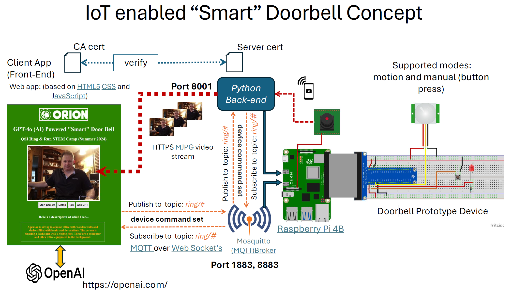

# Objective (STEM Project) Build a IoT Enabled d “Smart” Doorbell

 
# Documentation:  <a href="./docs/RingandRun-Final.pdf"> Project Pdf </a>

## That will…
- Display streaming video in a Web App when the doorbell button is pressed, or when motion is detected
- Play a customizable doorbell chime
- Provide an intercom system to allow remote communication between the App and the person at the door
- Use Advanced Artificial Intelligence to describe ”who” or “what” is at the door
- Ensure secure/encrypted communication between theDoorbell and the Web App.
- Whatever else you can make it do…
## Using…
- Raspberry Pi 4B
- Electronic components the make up the doorbell
- OpenAI Advanced Artificial Intelligence
- Software that you develop to make it all work

# Goals and Outcomes 
## Learn, Get Inspired, and Get Involved
- Learn about advanced technology…
- Raspberry Pi single board computer (SBC) and common uses
- The basics of the Linux operating system
- Basic fundamentals of the electronic device prototyping
- Internet of Things (IoT) Systems
- Explore/discover programming concepts
- Python, JavaScript, CSS (Cascading Style Sheets), and HTML 5
- Discover network protocols and methods for ensuring computer/network security
- TCP/IP, MQTT, PKI, HTTPS(TLS), etc.
- Exposure to the latest OpenAI Chat GPT (Artificial intelligence) services and models
- Get inspired,discover your talents, perhaps go to university and pursue a high technology career.
- Do Great things!
- Enjoy what you do!

 
